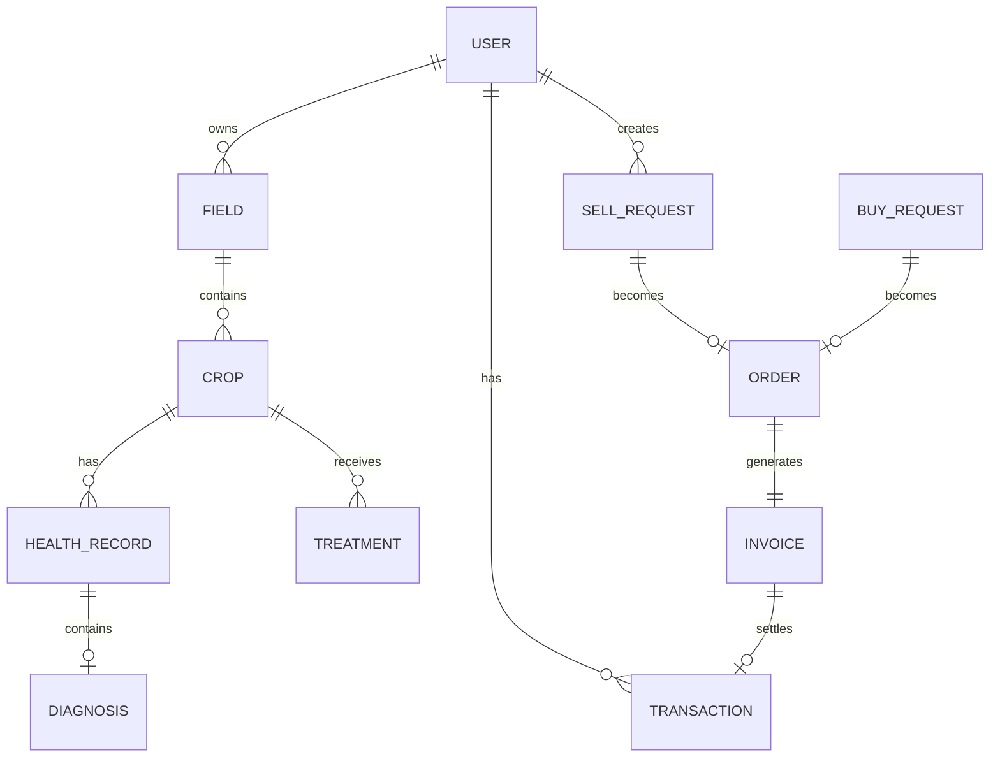

# FarmAgent - Data Model Documentation

**Version:** 2.0  
**Date:** January 24, 2026  
**Project:** FarmAgent - Autonomous AI Agent for Small-Scale Farmers in Uganda

---

## 1. Database Architecture

| Database | Services | Purpose |
|----------|----------|---------|
| PostgreSQL | Keycloak, Crop, Payment | Transactional data |
| MongoDB | Notification, AI Agent | Documents, logs |
| Redis | All services | Cache, sessions |
| S3/MinIO | AI Agent | Images, ML models |

---

## 2. Entity-Relationship Diagram



---

## 3. Keycloak User Model

Keycloak manages users externally. Services reference users by `keycloak_id`.

| Attribute | Type | Description |
|-----------|------|-------------|
| id (UUID) | string | Keycloak user ID |
| username | string | Phone number |
| email | string | Optional email |
| firstName | string | First name |
| lastName | string | Last name |
| attributes.district | string | Uganda district |
| attributes.language | string | en, lg, run |
| attributes.farm_size | string | Farm size in acres |

---

## 4. Crop Service Entities (PostgreSQL)

### 4.1 fields

| Column | Type | Constraints | Description |
|--------|------|-------------|-------------|
| id | UUID | PK | Unique identifier |
| user_id | STRING | NOT NULL | Keycloak user ID |
| name | VARCHAR(100) | NOT NULL | Field name |
| latitude | DECIMAL(10,8) | NOT NULL | GPS latitude |
| longitude | DECIMAL(11,8) | NOT NULL | GPS longitude |
| size_acres | DECIMAL(10,2) | NOT NULL | Field size |
| soil_type | VARCHAR(50) | NULLABLE | Soil type |
| created_at | TIMESTAMP | NOT NULL | Creation time |
| updated_at | TIMESTAMP | NOT NULL | Last update |

### 4.2 crops

| Column | Type | Constraints | Description |
|--------|------|-------------|-------------|
| id | UUID | PK | Unique identifier |
| field_id | UUID | FK → fields.id | Field reference |
| crop_type | VARCHAR(50) | NOT NULL | maize, cassava, coffee |
| variety | VARCHAR(100) | NULLABLE | Specific variety |
| planting_date | DATE | NOT NULL | Date planted |
| expected_harvest | DATE | NULLABLE | Expected harvest |
| status | VARCHAR(20) | NOT NULL | planted, growing, harvested |
| created_at | TIMESTAMP | NOT NULL | Creation time |
| updated_at | TIMESTAMP | NOT NULL | Last update |

### 4.3 crop_health_records

| Column | Type | Constraints | Description |
|--------|------|-------------|-------------|
| id | UUID | PK | Unique identifier |
| crop_id | UUID | FK → crops.id | Crop reference |
| check_date | TIMESTAMP | NOT NULL | When checked |
| health_score | INT | CHECK (0-100) | Overall health |
| image_url | VARCHAR(500) | NOT NULL | S3 image URL |
| disease_detected | VARCHAR(100) | NULLABLE | Disease name |
| confidence | DECIMAL(5,4) | NULLABLE | AI confidence |
| severity | VARCHAR(20) | NULLABLE | mild, moderate, severe |
| created_at | TIMESTAMP | NOT NULL | Creation time |

### 4.4 treatments

| Column | Type | Constraints | Description |
|--------|------|-------------|-------------|
| id | UUID | PK | Unique identifier |
| crop_id | UUID | FK → crops.id | Crop reference |
| health_record_id | UUID | FK | Triggering diagnosis |
| disease_name | VARCHAR(100) | NOT NULL | Target disease |
| treatment_name | VARCHAR(200) | NOT NULL | Treatment applied |
| treatment_type | VARCHAR(20) | NOT NULL | chemical, organic |
| application_date | DATE | NOT NULL | When applied |
| cost | DECIMAL(12,2) | NULLABLE | Cost in UGX |
| effectiveness | INT | CHECK (1-5) | Farmer rating |
| created_at | TIMESTAMP | NOT NULL | Creation time |

---

## 5. Payment Service Entities (PostgreSQL)

### 5.1 transactions

| Column | Type | Constraints | Description |
|--------|------|-------------|-------------|
| id | UUID | PK | Unique identifier |
| user_id | STRING | NOT NULL | Keycloak user ID |
| order_id | UUID | NULLABLE | Related order |
| type | VARCHAR(20) | NOT NULL | payment, receipt, refund |
| amount | DECIMAL(14,2) | NOT NULL | Amount in UGX |
| provider | VARCHAR(20) | NOT NULL | mtn, airtel |
| provider_ref | VARCHAR(100) | NULLABLE | Provider reference |
| external_id | VARCHAR(100) | UNIQUE | Our reference |
| phone_number | VARCHAR(20) | NOT NULL | MoMo number |
| status | VARCHAR(20) | NOT NULL | pending, completed, failed |
| created_at | TIMESTAMP | NOT NULL | Creation time |
| updated_at | TIMESTAMP | NOT NULL | Last update |

### 5.2 invoices

| Column | Type | Constraints | Description |
|--------|------|-------------|-------------|
| id | UUID | PK | Unique identifier |
| order_id | UUID | FK | Order reference |
| seller_id | STRING | NOT NULL | Seller Keycloak ID |
| buyer_id | STRING | NOT NULL | Buyer Keycloak ID |
| invoice_number | VARCHAR(20) | UNIQUE | INV-20260124-001 |
| amount | DECIMAL(14,2) | NOT NULL | Total amount |
| status | VARCHAR(20) | NOT NULL | unpaid, paid, cancelled |
| due_date | DATE | NOT NULL | Payment deadline |
| created_at | TIMESTAMP | NOT NULL | Creation time |

### 5.3 market_prices

| Column | Type | Constraints | Description |
|--------|------|-------------|-------------|
| id | UUID | PK | Unique identifier |
| crop_type | VARCHAR(50) | NOT NULL | Crop type |
| price_per_kg | DECIMAL(12,2) | NOT NULL | Price in UGX |
| district | VARCHAR(100) | NOT NULL | Location |
| market_name | VARCHAR(100) | NULLABLE | Market name |
| date | DATE | NOT NULL | Price date |
| source | VARCHAR(50) | NOT NULL | wfp, uce, manual |
| created_at | TIMESTAMP | NOT NULL | Creation time |

### 5.4 sell_requests

| Column | Type | Constraints | Description |
|--------|------|-------------|-------------|
| id | UUID | PK | Unique identifier |
| user_id | STRING | NOT NULL | Farmer Keycloak ID |
| crop_type | VARCHAR(50) | NOT NULL | Crop type |
| quantity_kg | DECIMAL(10,2) | NOT NULL | Amount available |
| asking_price | DECIMAL(12,2) | NOT NULL | Price per kg |
| latitude | DECIMAL(10,8) | NOT NULL | Pickup latitude |
| longitude | DECIMAL(11,8) | NOT NULL | Pickup longitude |
| status | VARCHAR(20) | NOT NULL | open, matched, completed |
| created_at | TIMESTAMP | NOT NULL | Creation time |

### 5.5 orders

| Column | Type | Constraints | Description |
|--------|------|-------------|-------------|
| id | UUID | PK | Unique identifier |
| sell_request_id | UUID | FK | Sell request |
| buy_request_id | UUID | FK | Buy request |
| seller_id | STRING | NOT NULL | Seller Keycloak ID |
| buyer_id | STRING | NOT NULL | Buyer Keycloak ID |
| quantity_kg | DECIMAL(10,2) | NOT NULL | Quantity |
| agreed_price | DECIMAL(12,2) | NOT NULL | Price per kg |
| total_amount | DECIMAL(14,2) | NOT NULL | Total value |
| status | VARCHAR(20) | NOT NULL | pending, delivered, paid |
| created_at | TIMESTAMP | NOT NULL | Creation time |

---

## 6. Notification Service Entities (MongoDB)

### 6.1 notifications

```json
{
  "_id": "ObjectId",
  "user_id": "keycloak-uuid",
  "type": "disease_alert | reminder | payment",
  "channel": "sms | push",
  "title": "string",
  "body": "string",
  "status": "pending | sent | delivered",
  "scheduled_at": "ISODate",
  "sent_at": "ISODate",
  "provider_ref": "string",
  "created_at": "ISODate"
}
```

### 6.2 notification_preferences

```json
{
  "_id": "ObjectId",
  "user_id": "keycloak-uuid",
  "sms_enabled": true,
  "push_enabled": true,
  "categories": {
    "disease_alerts": { "sms": true, "push": true },
    "market_updates": { "sms": false, "push": true },
    "reminders": { "sms": true, "push": true }
  },
  "updated_at": "ISODate"
}
```

---

## 7. AI Agent Entities (MongoDB)

### 7.1 diagnoses

```json
{
  "_id": "ObjectId",
  "health_record_id": "uuid",
  "image_url": "s3://...",
  "model_version": "v1.2.0",
  "results": {
    "disease": "Cassava Brown Streak",
    "confidence": 0.87,
    "severity": "moderate",
    "affected_area_pct": 35
  },
  "alternatives": [
    { "disease": "Cassava Mosaic", "confidence": 0.12 }
  ],
  "processing_time_ms": 2340,
  "created_at": "ISODate"
}
```

### 7.2 recommendations

```json
{
  "_id": "ObjectId",
  "diagnosis_id": "ObjectId",
  "treatment": {
    "name": "Neem-based pesticide",
    "type": "organic",
    "application": "Spray every 7 days",
    "cost_estimate": 15000
  },
  "prevention": ["Use resistant varieties", "Proper spacing"],
  "follow_up_date": "ISODate",
  "created_at": "ISODate"
}
```

---

## 8. Enumerations

### Crop Status

`planted` | `growing` | `flowering` | `harvesting` | `harvested` | `failed`

### Disease Severity

`mild` | `moderate` | `severe` | `critical`

### Treatment Type

`chemical` | `organic` | `cultural` | `biological`

### Transaction Status

`pending` | `processing` | `completed` | `failed` | `refunded`

### Order Status

`pending` | `confirmed` | `in_transit` | `delivered` | `paid` | `cancelled`

---

## 9. Indexes

| Table | Index | Purpose |
|-------|-------|---------|
| crops | (field_id, status) | Filter by field |
| crop_health_records | (crop_id, check_date DESC) | Health history |
| market_prices | (crop_type, date) | Price lookup |
| transactions | (user_id, created_at) | User history |
| sell_requests | (status, created_at) | Active listings |

---

## Document History

| Version | Date | Changes |
|---------|------|---------|
| 1.0 | 2026-01-23 | Initial data model |
| 2.0 | 2026-01-24 | Revised for Go/GORM, Keycloak user refs |
