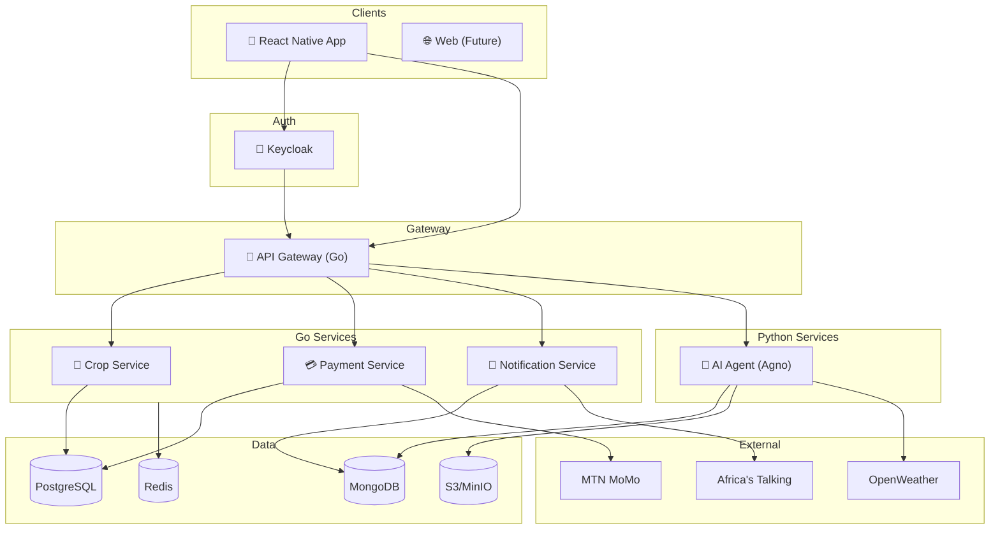
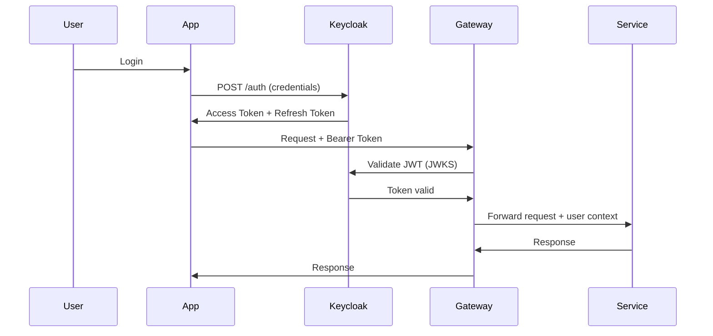

# FarmAgent - System Architecture Document

**Version:** 2.0  
**Date:** January 24, 2026  
**Project:** FarmAgent - Autonomous AI Agent for Small-Scale Farmers in Uganda

---

## 1. Architecture Overview

### 1.1 Technology Stack Summary

| Component | Technology | Rationale |
|-----------|------------|-----------|
| **Authentication** | Keycloak | OAuth2/OIDC, user management |
| **API Gateway** | Go (Gin) | High performance, routing |
| **Crop Service** | Go (Gin + GORM) | CRUD, business logic |
| **Payment Service** | Go (Gin) | Mobile money integration |
| **Notification Service** | Go (Gin) | SMS, push notifications |
| **AI Agent** | Python (Agno + FastAPI) | Agentic AI, disease detection |
| **Mobile App** | React Native | Cross-platform |
| **Databases** | PostgreSQL, MongoDB, Redis | Polyglot persistence |

### 1.2 High-Level Architecture



---

## 2. Microservices Design

### 2.1 Service Catalog

| Service | Language | Framework | Port | Database |
|---------|----------|-----------|------|----------|
| **Keycloak** | Java | Keycloak | 8080 | PostgreSQL |
| **API Gateway** | Go | Gin | 8000 | Redis |
| **Crop Service** | Go | Gin + GORM | 8001 | PostgreSQL |
| **Payment Service** | Go | Gin + GORM | 8002 | PostgreSQL |
| **Notification Service** | Go | Gin | 8003 | MongoDB |
| **AI Agent** | Python | Agno + FastAPI | 8004 | MongoDB, S3 |

### 2.2 Keycloak (Authentication)

**Responsibilities:**

- User registration and login
- OAuth2/OIDC token issuance
- Role-based access control (RBAC)
- Social login (future: Google, Facebook)
- Multi-factor authentication
- User profile management

**Realm Configuration:**

```
Realm: farmagent
Clients:
  - mobile-app (public client)
  - api-gateway (confidential client)
Roles:
  - farmer
  - extension_officer
  - buyer
  - admin
```

### 2.3 API Gateway (Go)

**Technology:** Go 1.22+, Gin framework

**Responsibilities:**

- JWT validation (Keycloak tokens)
- Request routing to services
- Rate limiting (100 req/min)
- CORS handling
- Request logging
- Health checks

**Key Packages:**

```go
github.com/gin-gonic/gin
github.com/golang-jwt/jwt/v5
github.com/go-redis/redis/v9
go.uber.org/zap
```

### 2.4 Crop Service (Go)

**Technology:** Go 1.22+, Gin, GORM

**Responsibilities:**

- Field management (CRUD)
- Crop lifecycle tracking
- Health records storage
- Treatment logging
- Growth stage monitoring

**Key Packages:**

```go
github.com/gin-gonic/gin
gorm.io/gorm
gorm.io/driver/postgres
github.com/google/uuid
```

**API Endpoints:**

```
GET    /fields           # List user fields
POST   /fields           # Create field
GET    /fields/:id       # Get field
PUT    /fields/:id       # Update field
DELETE /fields/:id       # Delete field

GET    /crops            # List crops
POST   /crops            # Create crop
GET    /crops/:id        # Get crop
PUT    /crops/:id        # Update crop
POST   /crops/:id/scan   # Submit health check (→ AI Agent)

GET    /crops/:id/health # Health history
POST   /crops/:id/treatments # Log treatment
```

### 2.5 Payment Service (Go)

**Technology:** Go 1.22+, Gin, GORM

**Responsibilities:**

- MTN Mobile Money integration
- Airtel Money integration
- Transaction management
- Invoice generation
- Payment callbacks

**Key Packages:**

```go
github.com/gin-gonic/gin
gorm.io/gorm
github.com/google/uuid
```

**API Endpoints:**

```
POST   /payments/initiate     # Start payment
POST   /payments/callback     # Provider webhook
GET    /transactions          # List transactions
GET    /transactions/:id      # Get transaction

GET    /invoices/:id          # Get invoice
POST   /refunds               # Process refund
```

### 2.6 Notification Service (Go)

**Technology:** Go 1.22+, Gin

**Responsibilities:**

- SMS via Africa's Talking
- Push notifications (FCM)
- Notification scheduling
- Delivery tracking
- User preferences

**API Endpoints:**

```
POST   /notify                # Send notification
POST   /schedule              # Schedule notification
GET    /notifications/:userId # User notifications
PUT    /preferences           # Update preferences
```

### 2.7 AI Agent (Python + Agno)

**Technology:** Python 3.11+, Agno, FastAPI, TensorFlow

**Responsibilities:**

- Autonomous crop health analysis
- Disease detection (ML model)
- Treatment recommendations
- Weather-based advice
- Harvest predictions

**Agent Architecture:**

```
┌─────────────────────────────────────────┐
│          FarmAgent (Agno)               │
├─────────────────────────────────────────┤
│  Tools:                                 │
│  ├── DiseaseDetector (TensorFlow)       │
│  ├── TreatmentAdvisor (Claude API)      │
│  ├── WeatherFetcher (OpenWeather)       │
│  └── MarketChecker (internal API)       │
├─────────────────────────────────────────┤
│  Autonomous Workflow:                   │
│  Image → Detect → Diagnose → Recommend  │
│       → Schedule Follow-up              │
└─────────────────────────────────────────┘
```

**API Endpoints:**

```
POST   /analyze           # Analyze crop image
GET    /diseases          # List detectable diseases
POST   /recommend         # Get treatment recommendation
GET    /agent/status      # Agent health check
```

---

## 3. Data Architecture

### 3.1 Database Strategy

| Database | Services | Purpose |
|----------|----------|---------|
| **PostgreSQL** | Crop, Payment, Keycloak | Transactional data |
| **MongoDB** | Notification, AI Agent | Documents, logs |
| **Redis** | Gateway, All services | Cache, sessions |
| **S3/MinIO** | AI Agent | Images, ML models |

### 3.2 Service Communication

| Pattern | Usage |
|---------|-------|
| **Sync (HTTP)** | Client → Gateway → Services |
| **Async (Redis Pub/Sub)** | Service → Notification triggers |
| **Events** | Crop scan → AI analysis → Treatment alert |

---

## 4. Authentication Flow



---

## 5. Monorepo Structure

```
farmagent/
├── apps/
│   └── mobile/                    # React Native
├── services/
│   ├── gateway/                   # Go
│   │   ├── cmd/
│   │   ├── internal/
│   │   ├── go.mod
│   │   └── Dockerfile
│   ├── crop-service/              # Go
│   │   ├── cmd/
│   │   ├── internal/
│   │   │   ├── handlers/
│   │   │   ├── models/
│   │   │   ├── repository/
│   │   │   └── services/
│   │   ├── go.mod
│   │   └── Dockerfile
│   ├── payment-service/           # Go
│   ├── notification-service/      # Go
│   └── ai-agent/                  # Python
│       ├── agent/
│       ├── api/
│       ├── models/
│       ├── requirements.txt
│       └── Dockerfile
├── packages/
│   └── go-common/                 # Shared Go utilities
├── infrastructure/
│   ├── docker-compose.yml
│   ├── keycloak/
│   │   └── realm-export.json
│   └── k8s/
├── docs/
└── README.md
```

---

## 6. Deployment

### 6.1 Docker Compose (Development)

```yaml
services:
  keycloak:
    image: quay.io/keycloak/keycloak:23.0
    ports: ["8080:8080"]
  
  postgres:
    image: postgres:16
    ports: ["5432:5432"]
  
  mongodb:
    image: mongo:7
    ports: ["27017:27017"]
  
  redis:
    image: redis:7-alpine
    ports: ["6379:6379"]
  
  gateway:
    build: ./services/gateway
    ports: ["8000:8000"]
  
  crop-service:
    build: ./services/crop-service
    ports: ["8001:8001"]
  
  payment-service:
    build: ./services/payment-service
    ports: ["8002:8002"]
  
  notification-service:
    build: ./services/notification-service
    ports: ["8003:8003"]
  
  ai-agent:
    build: ./services/ai-agent
    ports: ["8004:8004"]
```

### 6.2 Production (Kubernetes)

| Component | Replicas | Resources |
|-----------|----------|-----------|
| Keycloak | 2 | 1Gi, 1 CPU |
| Gateway | 3 | 256Mi, 0.5 CPU |
| Crop Service | 2 | 256Mi, 0.5 CPU |
| Payment Service | 2 | 256Mi, 0.5 CPU |
| Notification Service | 2 | 256Mi, 0.5 CPU |
| AI Agent | 2 | 1Gi, 1 CPU |

---

## 7. Security

| Layer | Implementation |
|-------|----------------|
| **Auth** | Keycloak OAuth2/OIDC |
| **Transport** | TLS 1.3 everywhere |
| **API** | JWT validation, rate limiting |
| **Data** | Encrypted at rest (PostgreSQL, S3) |
| **Secrets** | Environment variables / K8s secrets |

---

## Document History

| Version | Date | Changes |
|---------|------|---------|
| 1.0 | 2026-01-23 | Initial architecture |
| 2.0 | 2026-01-24 | Revised to Go-centric stack, added Keycloak, Agno |
